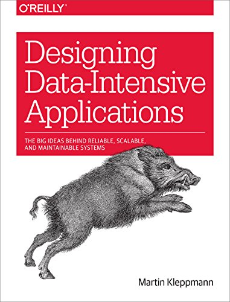

# Designing_Data_Intensive_Applications

- [Designing_Data_Intensive_Applications](#designing_data_intensive_applications)
- [Part 1: The fundamental ideas that underpin the design of data-intesive applications.](#part-1-the-fundamental-ideas-that-underpin-the-design-of-data-intesive-applications)
  - [Chapter 1. What is Reliability,Scalability and maintanability ?](#chapter-1-what-is-reliabilityscalability-and-maintanability-)
    - [Reliability:](#reliability)
    - [Describing Performance:](#describing-performance)
  - [Chapter 2. Data models and query languages](#chapter-2-data-models-and-query-languages)
- [Part 2: Move from data store on one machone tp data that is distributed across machines. Often needed for scalability.](#part-2-move-from-data-store-on-one-machone-tp-data-that-is-distributed-across-machines-often-needed-for-scalability)
- [Part 3: Discuss Systems that derive some datasets from other datasets. Derived data often occurs in heterogenerous systems(multiple system CPU, GPU) where one database can't do everything well. Potential example is a media website that use mySql for user account data and AWS S3 buckets for storing the media.](#part-3-discuss-systems-that-derive-some-datasets-from-other-datasets-derived-data-often-occurs-in-heterogenerous-systemsmultiple-system-cpu-gpu-where-one-database-cant-do-everything-well-potential-example-is-a-media-website-that-use-mysql-for-user-account-data-and-aws-s3-buckets-for-storing-the-media)

Summary for Book Data Intensive Applications  

# Part 1: The fundamental ideas that underpin the design of data-intesive applications.

## Chapter 1. What is Reliability,Scalability and maintanability ?

### Reliability:
- Simple Definition: Continue to work correctly, even when things go wrong.  
- Things that can go wrong are faults. System anticipating faults are fault-tolerant or resilient.
- Fault is not the same as a failure. Fault is deviating from the spec of the system.
- Errors come from. Hardware Errors, Software Errors, Human Errors. One study found configuration errors by operators to be the leading cause of outages, where hardware faults (servers or network) 
### Describing Performance:
  - In a batch processing system such as hadoop, we usually care about _throughput_. **In online systems** service's response time is more important
  - **Response times** should be thought as a distributions of values.
  - Latency and Response Time are completly different. Latency is how long it takes for the service to start handle the request (think network path, queue waiting etc). 
  - Media is a good way to see how the average user experience, since 50% will be slower and 50% faster 
  - Outlines are catch better by p95, p99, p99.9
    - Amazon targets for internal service 99.9%. Even though it only affects only 1 in 1000 request is because those with slowest request are often the ones who have the most data on their acount, because they have made many purchases--in short, they are the most valuable customers.
    - amazon has also observed 100ms increase in respose time reduse sales by 1%, and other reports that 1 second slowdown reduces customer satisfaction metric by 16%.

## Chapter 2. Data models and query languages

- Chapter 3 
- Chapter 4

# Part 2: Move from data store on one machone tp data that is distributed across machines. Often needed for scalability.  

# Part 3: Discuss Systems that derive some datasets from other datasets. Derived data often occurs in heterogenerous systems(multiple system CPU, GPU) where one database can't do everything well. Potential example is a media website that use mySql for user account data and AWS S3 buckets for storing the media. 
